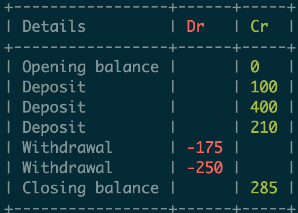

# BankEs

## EventSourcing and CQRS application in Elixir

To start your Phoenix server:

- Install dependencies with `mix deps.get`
- Create and migrate your database with `mix db.setup`
- Install Node.js dependencies with `cd assets && npm install`
- Start endpoint with `make run-dev`

```elixir
iex(1)> {:ok, account} = BankEs.create_account()
iex(2)> {:ok, account} = BankEs.deposit_money(account.account_number, 100)
iex(3)> {:ok, account} = BankEs.deposit_money(account.account_number, 400)
iex(4)> {:ok, account} = BankEs.deposit_money(account.account_number, 210)
iex(5)> {:ok, account} = BankEs.withdraw_money(account.account_number, 175)
iex(6)> {:ok, account} = BankEs.withdraw_money(account.account_number, 250)
iex(7)> BankEs.print_statement(account.account_number)
```


